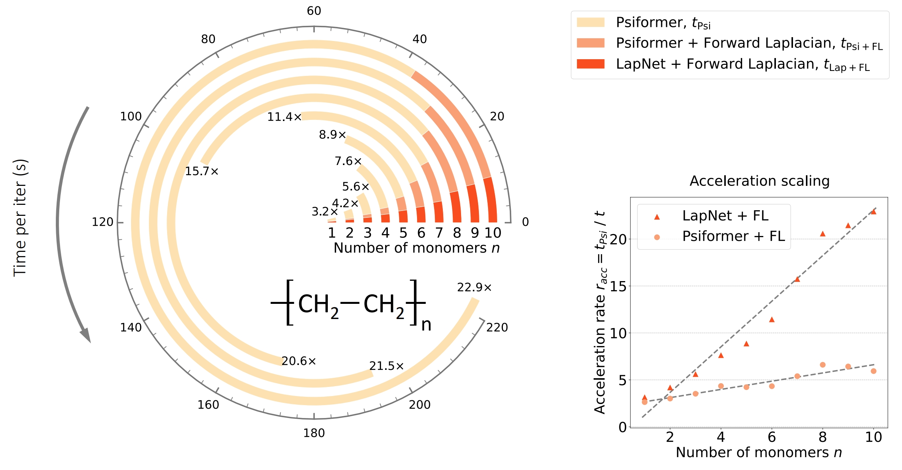

# LapJAX: Efficient Forward-mode Laplacian Computation in JAX
LapJAX is a JAX-based python package that accelerates laplacian computation automatically using a technique called "Forward Laplacian". It leverages the properties of forward computation mode and the sparsity of various operators, and significantly accelerates computation in proportion to system sizes. Notably, LapJAX acceleration is in loss of no precision. For more details including mathematical derivitations, please refer to the [forward laplacian paper](https://arxiv.org/abs/2307.08214).

**WIP Repo**: This repo is still under development. We sincerely thank you in advance for your understanding, and appreciate any feedback, suggestions, and contributions. See [contributing guidelines](#contributions) for more.



### Installation
To install LapJAX together with all the dependencies (excluding JAX), go to the root directory and run

```shell
pip install .
```

Notice that you are required to *pre-install* an appropriate version of JAX before running the command above. Currently, we do not support `-e` option (editable installation). 

**GPU Support**: To use LapJAX on GPU, you only need to ensure the installed `jax` supports GPU computation. For example, you can run:
```shell
pip install --upgrade jax[cuda]==0.3.24 -f https://storage.googleapis.com/jax-releases/jax_cuda_releases.html
```
Please see the
[JAX documentation](https://github.com/google/jax#installation) for more
details.

**Post Installation Check**: To check whether LapJAX is successfully installed, you can run
```python
python test/test_funcs.py
```


### Usage
We highly recommend going through the Jupyter notebook `lapjax-tutorial.ipynb` to get a better understanding of LapJAX. Here we provide a brief introduction to how to use LapJAX. Assume you have written a function `f(x)` using JAX where `x` is a `jax.Array`. To compute the laplacian of `f(x)` w.r.t. `x`, i.e. $\nabla^2 f(x)$ with LapJAX:
1. Replace `jax` with `lapjax`, e.g.,
```python
# import jax.numpy as jnp
# from jax import vmap
import lapjax.numpy as jnp
from lapjax import vmap

def f(x):
  # Your code here.
  pass
```
2. Create a LapTuple from the input, pass it to the function directly, and obtain the laplacian, e.g.
```python
from lapjax import LapTuple, TupType

# input_x is the input of f(x)
def lap_of_f(x):
  input_x = LapTuple(input_x, is_input = True)
  output = f(input_x)
  return output.get(TupType.LAP)
```
**A Quick Look**: LapJAX explicitly wraps various JAX functions such that they can take a data structure called LapTuple as input. Here, LapTuple is a tuple-like structure containing $(x, \nabla x, \nabla^2 x)$. When receiving LapTuple inputs, LapJAX wrapped operators automatically compute the gradient and laplacian of the output w.r.t. the input, and output the LapTuple $(f(x), \nabla f(x), \nabla^2 f(x))$. 

**Attention**: When the input is a standard JAX Array, LapJAX operators behave the same as JAX operators.

**JAX-based Packages**: 
Many popular packages rely on JAX. For now, we cannot wrap the functions in these packages directly. However, we provide a replacement trick to make LapJAX compatible with these packages. Before importing any JAX-based packages, you can run
```python
import lapjax
import sys
sys.modules['jax'] = lapjax
```
This replaces the system module `jax` with `lapjax`. Other packages importing `jax` ends up relying on `lapjax`, which handles LapTuple inputs. Notice that it is possible that this method would cause additional unexpected issues. Please raise issues if you have any problems.

### Supported Functions
LapJax wraps many commonly used JAX operators that support LapTuple inputs (most of which are in `jax.numpy`). However, we acknowledge that the supported functions are a still small subset. You can use `lapjax.is_wrapped(f)` to check whether JAX function `f` is supported, or you can get all supported functions via `lapjax.get_all_wrapped_names()`. Below is the list of supported functions (`jnp` stands for `jax.numpy`, and `jlax` stands for `jax.lax`). To understand the classification of these functions, please refer to the tutorial.

```python
FType.CONSTRUCTION: [
  jnp.shape, jnp.size, jnp.eye, jnp.array, jnp.ones, jnp.ones_like, jnp.zeros, jnp.zeros_like, jnp.asarray, jnp.sign, jlax.stop_gradient,
],

FType.LINEAR: [
jnp.reshape, jnp.transpose, jnp.swapaxes, jnp.split, jnp.array_split, jnp.concatenate, jnp.squeeze, jnp.expand_dims, jnp.repeat, jnp.tile, jnp.where, jnp.triu, jnp.tril, jnp.sum, jnp.mean, jnp.broadcast_to,
],

FType.ELEMENT: [
jnp.sin, jnp.cos, jnp.tan, jnp.arcsin, jnp.arccos, jnp.arctan, jnp.arcsinh, jnp.arccosh, jnp.arctanh, jnp.sinh, jnp.cosh, jnp.tanh, jnp.exp, jnp.log, jnp.exp2, jnp.log2, jnp.square, jnp.sqrt, jnp.power, jnp.abs, jnp.absolute, jlax.sin, jlax.cos, jlax.tan, jlax.asin, jlax.acos, jlax.atan, jlax.asinh, jlax.acosh, jlax.atanh,  jlax.exp, jlax.log, jlax.square, jlax.sqrt, jlax.rsqrt,  jlax.pow, jlax.integer_pow, jlax.abs, 
],

FType.OVERLOAD: [
  jnp.add, jnp.subtract, jnp.multiply, jnp.divide, jnp.true_divide
],

FType.MERGING: [
  jnp.linalg.norm, jnp.prod,
],

FType.CUSTOMIZED: [
  jnp.matmul, jnp.dot, jnp.max, jnp.min, jnp.amax, jnp.amin, jnp.linalg.slogdet, jax.nn.logsumexp, jax.nn.softmax,
],

FType.EMPTY: [
  jax.vmap,
],
```

### Add Your Functions
We give a few examples of how to easily support other JAX functions with LapTuple inputs in `lapjax-tutorial.ipynb`. Here we provide a quick introduction:
1. Check whether the function can be classified as an existing function FType. For example, for construction functions, linear functions, element-wise functions and merging functions, LapJAX provides a general handler, and you can directly run
```python
from lapjax import numpy, custom_wrap, FType
custom_wrap(numpy.isnan, FType.CONSTRUCTION)
``` 
2. If the function does not belong to any of the four FTypes above, you need to write a derivative computation and laplacian computation code yourself, and use `custom_wrap` to bind it to the function. 

**Checking Correctness**: To automatically check the correctness of functions you wrap, please use `lapjax.create_check_function`. For example, to check the correctness of `lapjax.numpy.sin`, you can run
```python
import time
import lapjax

wrap_func = lapjax.numpy.sin # assume you have wrapped it
test_input = lapjax.numpy.ones([3,5])

checker = lapjax.create_check_function(
  wrap_func, derivative_args=(0,), seed=42)
grad_diff, lap_diff = checker(test_input)
print(f'gradient difference: {grad_diff}, laplacian difference: {lap_diff}')
```
Here, `checker` takes standard `jax.Array` inputs (same as `jax.numpy.sin`), and we explicitly convert it into LapTuple via the argument `derivative_args` that specifies which input arguments should be converted. Currently, we do not support any convertion of keyword arguments. Similarly, you can specify which outputs you want to check using `derivative_outputs` (default is `(0,)`). For example, `lapjax.numpy.linalg.slogdet` outputs `(sign, logdet)`, and you should set `derivative_outputs=(1,)`. 

### Contributions
We sincerely thank you for any feedback, suggestions, and contributions. The following contributions are especially welcome:
- Support more JAX operators with LapTuples as inputs, especially functions in `jax.numpy` and `jax.lax`.
- Support JAX built-in functions with LapTuples as inputs, e.g., `jax.grad` and `jax.jacobian`. Notice that although `jax.grad` cannot apply to functions that take LapTuples as inputs, you are free to create a function that maps input to its laplacian, and apply `jax.grad` to this function. This means you can use `jax.grad` to compute the gradient of the laplacian of a function.
- Better cooperation with JAX and other JAX-based packages like `haiku`. For now, you have to use `sys.modules` replacement trick to support JAX-based operators in `haiku`. We are looking forward to a better solution.
- Any other contributions that can improve the performance or the usability of LapJAX!


### Citation
If you find this repo useful, please cite our paper:
```
@article{li2023forward,
  title={Forward Laplacian: A New Computational Framework for Neural Network-based Variational Monte Carlo},
  author={Li, Ruichen and Ye, Haotian and Jiang, Du and Wen, Xuelan and Wang, Chuwei and Li, Zhe and Li, Xiang and He, Di and Chen, Ji and Ren, Weiluo and others},
  journal={arXiv preprint arXiv:2307.08214},
  year={2023}
}
```


